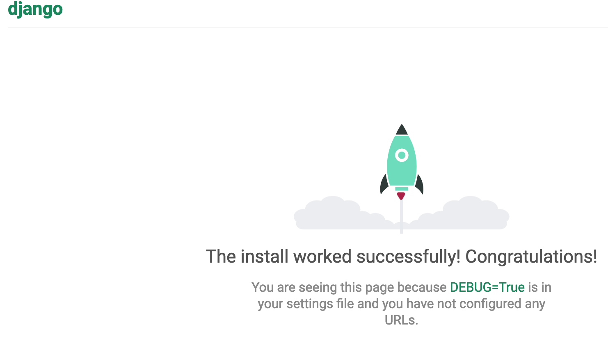
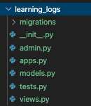
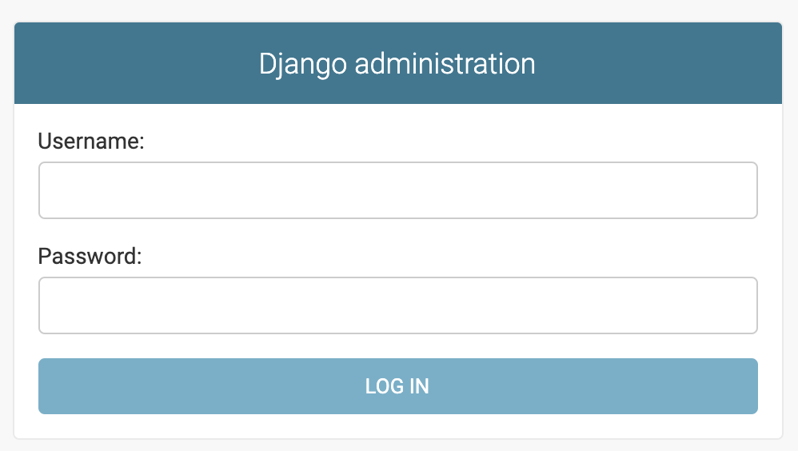
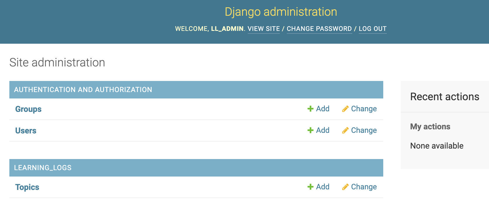
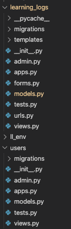

# Learning Logs project
1) Base project from `Python Crash course 2nd ed` by `Eric Matthes`
2) Prior to deployment, the following steps are requried to launch project
    - Launch virtual environment 
        - `source ll_env/bin/activate`
    - Run the Django server
        - `python manage.py runserver`
3) Each `Model` is essentially a special class Django uses to present data
4) Each `View` is a special function that processes the data of user request and presents a UI to the browser. A base `template` is often used to prepare the UI for different views. 

## Initial Setup

### Virtual environment
A virtual environment ties the application with all its required packages into a 
1) Create virtual environment called `ll_env` by entering into terminal: 
    - `python3 -m  venv ll_env`
    - There should be a new folder called `ll_env` that contains a `pyenv.cfg` file.
2) Activate the virtual environment (for Mac Os)
    - `source ll_env/bin/activate` 
     - the start of your path should now show `(ll_env)`
3) Exit or deactivate virtual environment 
    - enter `deactivate` in terminal OR close terminal to exit the virtual environment

## Setting up Django
### Django Installation
1) Activate virtual environment
2) Install Django in terminal using
    - `pip install Django`
### Create new project called `learning_log`    
1) !! you MUST include the period at the end !! Create project using 
    - `django-admin.py startproject learning_log .`
2) this will create the following :
    - `manage.py` a project specific file that directs commands to various parts of Django. Specifically, it
        - puts proejct packages on the `sys.path`
        - sets up the `DJANGO_SETTINGS_MODULE` environment variable so that it points to the project settings file
    - `learning_log` directory that contains:
        - settings.py >> manages Django behavior   
        - urls.py >> manages pages Django creates
        - wsgi.py >> manages a `web server gateway interface`
    #### Although `django-admin` is the CLI for adminstrative tasks, it is simpler to manage a project through `manage.py`
### Database Installation
1) Create the database (SQLite by default):
    - `python manage.py migrate`
2) this will create a `db.sqlite3` file 
### Run Server to view the boiler plate project
1) Run the server to verify the project setup
    - `python manage.py runserver`
    - The following default page can be seen on a browser directed to `http://127.0.0.1:8000/`
        
   

2) If you accidentally close the terminal in VSCODE and need to quit the server, enter the following in a new terminal
    - `sudo kill $(lsof -t -i:8000)`
3) Quit the server using `CONTROL-C`    
### Create Django setup files for new app called `learning_logs`
1) In a new terminal window, activate the virtual environment 
    -`source ll_env/bin/activate` 
2) Run startapp to build initial infrastructure files
    - `python manage.py startapp learning_logs`
3) This will create a new directory with the following files:
        

    - `models.py` >> manages app data
    - `admin.py` >> displays models in the django admin panel
    - `views.py` >> views are a Python function or class that takes a web request and returns a web response. In Django, views have to be created in the app's views.py file  
### Define models
Models are simply clases that define how Danjgo should interact with the app's data.  

Add the `Topic` class to `models.py`
~~~ python
from django.db import models

# Create your models here.

class Topic(models.Model):
    """ Topic that the use in learning about """
    text = models.CharField(max_length=200) # allocates 200 chars in database
    data_added = models.DateTimeField(auto_now_add=True) # sets to current data/time when new topic created
    def __str__(self):
        """ Return a string representation of the model """
        return self.text
~~~

### Activate model 
Django looks inside `settings.py` at the `INSTALLED_APPS` list to determine which apps are part of the project beyond the initial built in apps. Add the follow section to bottom of the `INSTALLED_APPS` section to let Django know that `learning_logs` is part of the project.
~~~ py
INSTALLED_APPS = [
    'django.contrib.admin',
    'django.contrib.auth',
    'django.contrib.contenttypes',
    'django.contrib.sessions',
    'django.contrib.messages',
    'django.contrib.staticfiles',
    # my apps
    'learning_logs',
]
~~~
### Update database for `Topic model` data
The `makemigrations` command builds a migrations file to create a table for the Topic model. In this case, it creates `0001_initial.py`
1) From the virual environment in terminal run:

    `python manage.py makemigrations learning_logs`
2) The following output indicates that the file was successfully created
    ~~~ bash
    Migrations for 'learning_logs':
    learning_logs/migrations/0001_initial.py
        - Create model Topic
    ~~~    
### Apply migration
This will modify database with the latest migrations file.
1) Run migrations

    `python manage.py migrate`
2) The following output indicates a successful migration
    ~~~ bash
    Operations to perform:
    Apply all migrations: admin, auth, contenttypes, learning_logs, sessions
    Running migrations:
    Applying learning_logs.0001_initial... OK
    ~~~

### The typical flow to update the database is:
1) Add specific `class` model to `models.py`
2) Run `makemigrations` to build a `migrations` file 
    `python manage.py makemigrations` <i>appname</i>
3) Run `migrations`
    `python manage.py migrate`

## Setting up `Admin Site`
### Create `superuser`
Adminstrators of site are `superusers` and have access rights to all priviledges (actions) and also maintain the priviledges of users of the site. A user has restrictive acces, typically read/write of their data. 
1) Create a superuser

    `python manage.py createsuperuser`
2) A prompt guides setting up `superuser` credentials:
- Username    <i>you can leave this blank to user current user logged into computer</i>
- email <i>this can be left blank</i>
- password <i>you will need to enter this twice</i>

### Register Model
Any models added to `models.py` must be registered manually in `admin.py`

~~~ py
from django.contrib import admin

# Register your models here.
from learning_logs.models import Topic  # import Topic model to be registered
admin.site.register(Topic)  # regsters Topic to be managed via admin site
~~~
- The admin can now be seen on a browser directed to `http://127.0.0.1:8000/admin`
        
   

1) Login using the `superuser` credentials    
2) The Site Adminstration interface should now display
   
   

### Adding data to the database  
Topics can be added to the database by clicking `Add`

### Create `Entry` model
A `many-to-one` relationship allows `many entries` to be associated with a single `topic`. This relationship may also be defined as a `one-to-many` where a single `topic` can have many `entries`.

In the `Entry class` model, a `foreign key` will relate an `entry`  with a specific `topic` value. 

1) `Add` the `Entry` class to `models.py`

    ~~~ py
    class Entry(models.Model): # inherit from Django's base Model class
        """ Something specific learned about a topic """     
        topic = models.ForeignKey(Topic,  on_delete=models.CASCADE)  # connects entry to a topic
        text = models.TextField()
        date_added = models.DateTimeField(auto_now_add=True)
        # tells Django to use  'Entries' deal with mutliple entries
        # otherwise Django creates 'Entrys'
        class Meta:
            verbose_name_plural = 'entries'

        # show only first 50 chars of text
        def __str__(self):
            """ Return a string represenation of the model """
            return self.text[:50] + "..."

    ~~~

A `many-to-many` relationship allows `many entries` to be associated with a `topic` as well as `many topics` to be associated with an `entry`. Creating a `many-to-many` relationship often involves connecting two `many-to-one` relationships using a `join table`.

2) `Build` this migrations file with `makemigrations` 
    `python manage.py makemigrations learning_logs`

    ~~~ bash
    Migrations for 'learning_logs':
    learning_logs/migrations/0002_entry.py
    - Create model Entry
    ~~~
3) `Run` the migration
    `python manage.py migrate`

    ~~~
    Migrations for 'learning_logs':
    learning_logs/migrations/0002_entry.py
        - Create model Entry
    (ll_env) 🤓[skutz@ ~/Documents/GitHub/learning_log_django $ python manage.py migrate
    Operations to perform:
    Apply all migrations: admin, auth, contenttypes, learning_logs, sessions
    Running migrations:
    Applying learning_logs.0002_entry... OK
    ~~~

## The typical flow to update the database is:
1) Add specific `class` model to `models.py`
2) Run `makemigrations` to build a `migrations` file 
    `python manage.py makemigrations` <i>appname</i>
3) Run `migrations`
    `python manage.py migrate`

### Register `Entry` model
1) Import the `Entry` model
    ~~~ py
    from .models import Topic, Entry    # Entry added
    ~~
2) Register the `Entry` model
    ~~~ py
    admin.site.register(Entry)
    ~~~
3) Run the server
    - `python manage.py runserver`
4) Verify that the admin panel shows entries     
    
 

5) Add simple entry info to verify that info is saved to database
## Mapping URLs and creating Views
- the imported `path` function maps URLs to views
- the `. import views` imports `views.py` view from within same folder
- the `app_name` variable defines the `urls.py` file from others with the same name
- the `urlpaterns` variable defines the pages available within the app
- the `path` function receives:
    - the `route` of the base URL
    - a call to the `index` function within `views.py`
    - defines a the name of the link to the index page     
1) Inside the `learning_log` folder, add the module `learning_logs.urls` to `urls.py`
    ~~~ py
    from django.contrib import admin
    from django.urls import path, include

    urlpatterns = [
        path('admin/', admin.site.urls),
        path('', include('learning_logs.urls')),
    ]
    ~~~
2) Inside the `learning_logs` folder(note difference) from above, create another `urls.py` and add the following:
    ~~~ py
    from django.urls import path

    from . import views

    app_name = 'learning_logs'
    urlpatterns = [
        # Home page
        path('', views.index, name = 'index'),
    ]
    ~~~

### Creating Home page `view`
1) Inside the `learning_logs` folder, add the following to `views.py`
    ~~~ py
    # Create your views here.
    def index(request):
        """ The home page for Learning Log """
        return render(request, 'learning_logs/index.html')
    ~~~
The render function receives:
- the `request object`
- a `template` used to build define how Django renders a page

### Creating a base template
1) Inside the `template/learning_logs` folder, create a new file `base.html`. This will have a core set of elements that other pages will inherit.

2) Using a `template tag`, create a `namespace` and `index`. We can pass in various `namespace` as a `URL pattern` in `url.py`

    ~~~ html
    

        <a href = ""> Learning Log </a>
    

    
    ~~~

3) See <a href = "https://docs.djangoproject.com/en/2.2/ref/templates/" > Django documentation on templates </a> for more info
### Creating a child template
1) The original `index.html` is modified to inherit content from the base template `base.html`
    ~~~ html
    

    

    
 Learning Log helps you keep track of you learning, for any topic you are learning about 

    
    ~~~

### Creating Topics page
1) Add to `urls.py` beneath `path('', views.index, name = 'index'),`
    ~~~ py
    app_name = 'learning_logs'
    urlpatterns = [
        # Home page
        path('', views.index, name = 'index'),
        # path that shows all topics
        path('topics/', views.topics, name = 'topics'),

    ]
    ~~~

2) Add to the top of `views.py`
    ~~~ py
    path('', views.index, name = 'index'),
    ~~~
This is needed to import the data needed
3) Add the `topics()` function to `views.py`
    ~~~ py
        def topics(request):
            """ Show all topics """
            topics = Topic.objects.order_by('data_added')
            context = {'topics': topics}
            return render(request, 'learning_logs/topics.html', context)
    ~~~
The request object is returned from the server and a query is set up. A `context` (e.g. dictionary with keys which represent names for the types of data) is returned to the template

### Creating Topics template
1) The `` tag tells `Django` to inherit from the defined base.html file.
    ~~~ py
        
    ~~~

2) Within the `` tags, a special tag that emulates a `for loop` is implemented. This willrender topics if present. Otherwsie default content is provided
    ~~~ py
        
                <li> {{topic}} </li>
            
                <li> No topics have been added yet </li>    
        
    ~~~

3) Within `base.html`, add a link to Topics. The dash after the first link is used to help separate the links for the user.
    ~~~ py
        

            <a href = ""> Learning Log </a> -
            <a href = ""> Topics </a>
        

    ~~~

### Creating individual topics page
1) Append the following into `urls.py`. The `topic_id` is used to call `topic()` with a unique database entry
    ~~~ py
        # detail page for a single topic based on id
        path('topics/<int:topic_id>/', views.topic, name = 'topic')
    ~~~
2) Create a `view function` within `views.py` that acccepts a parameter for the topic_id in addition to the `request object`. Queries are created for `topic` and `entries`.
    ~~~ py
        def topic(request, topic_id):
            """ Show a single topic and all of its entries""" 
            topic = Topic.objects.get(id=topic_id)
            entries = topic.entry_set.order_by('-date_added')
            context = {'topic': topic, 'entries': entries}
            return render(request, 'learning_logs/topic.html', context)  
    ~~~
3) Add a `topic.html` page that inherits from  `base.html`.
    ~~~ html
        

        

        
 Topic:: {{topic} 
}

        
 Entries: 

        <ul>
        
            <li>
            
{{ entry.date_added|date:'M d, Y H:i' }}

            
{{ entry.text|linebreaks }}

            </li>
            
            <li> There are no entries for this topic yet </li>
           
        </ul>

        
    ~~~

## Creating forms for user input

### New Topics Form
1) Using `Djangos` class `ModelForm`, create `forms.py` inside the application folder `learning_logs`
    - `TopicForm` inherits from `forms.ModelForm`
    - The `model` is based from the `Topic` model
    - The form will have a `text field` without a `label`
        ~~~ py
            from django import forms

            from .models import Topic

            class TopicForm(forms.ModelForm):
                class Meta:
                    model = Topic
                    fields = [ 'text' ]
                    labels = { 'text': '' }
        ~~~

2) Add the `URL` for the form to `urls.py`
    - The URL pattern will direct requests to the `new_topic()` view function
        ~~~ py
        urlpatterns = [
            # Home page
            path('', views.index, name = 'index'),
            # path that shows all topics
            path('topics/', views.topics, name = 'topics'),
            # detail page for a single topic based on id
            path('topics/<int:topic_id>/', views.topic, name = 'topic'),
            # form page for adding new topic
            path('new_topic/', views.new_topic, name = 'new_topic')
        ]
        ~~~    

3) Create the `new_topic` view function in `views.py`
    - In addition to render, the `redirect` function is imported in order to send the user(e.g. redirect) to the topics back after a new topic is written to the database via `form.save()`
    - `form = TopicForm()` assigns an instance of TopicForm to the variable `form`
    - the `context dictionary` contains the template for the form
        ~~~ py
        def new_topic(request):
        """ Add new topic """       
        if (request.method != 'POST' and request.method == 'GET'):
            # There was no POST data sumitted, return blank form
            form = TopicForm()
        else:
            # POST data exists, process data within request.POST
            form = TopicForm(data = request.POST)
            if form.is_valid():
                form.save()
                return redirect('learning_logs:topics')

        # Display a blank or invalid form
        context = {'form': form}
        return render(request, 'learning_logs/new_topic.html', context)
        ~~~

4) Create the form for creating a new topic
    - The `new_topic` function receives the submitted form data as a `POST` request 
    - `` prevents `cross-site request forgery` hacker attacks to the server
    - The `{{ form.as_p }}` template variable uses the `as_p` modifier to render the form as `p elements`

        ~~~ html
        

        
            
 Add a new topic: 

            <form action = "" method = 'post'>
                
                {{ form.as_p }}

                <button name = "submit"> Add a new topic </button>
            </form>

         
        ~~~     

5) Link the `new_topic` page within `topics.html`
    - Add the last line so that `topics.html` now looks like
        ~~~ html
        

        

            
 Topics 

            <ul>
                
                    <li> 
                        <a href="">{{ topic }}</a>           
                    </li>
                
                    <li> No topics have been added yet </li>    
                
            </ul>

            <a href = ""> Add a new topic </a>

          

        ~~~

6) Append to the import in `forms.py` and add a class to manage user entries
    - the default Django widget is overidden with the custom widget attribute to make the test area 80 coluimns wide(default would be 40 columns)
    - The labels field is assigned a blank label
    ~~~ py
    from .models import Topic, Entry
    
    ...

    class EntryForm(forms.ModelForm):
        class Meta:
            model = Entry
            fields = ['text']      
            labels = {'text': ''}
            widget = {'text': forms.Textarea(attrs = {'cols': 80})}
    ~~~

### New Entries Form    
1) Add URL for new_entry to `urls.py`
    ~~~ py
    # Page for new entries  
    path('new_entry/<int:topic_id>/', views.new_entry, name = 'new_entry'),
    ~~~
2) Create `new_entry` View function in `views.py`
    - topic variable is assigned to specific id of topic
    - if request method is `POST`, create an instance of `EntryForm` using the returned `POST` data
    - the `commit=False` argument prevents the database from being updated. The `new_entry` object also requires the `topic` attribute to be set with the `topic_id` before writing to the database
    - the `redirect` function requires 2 arguments this time since the `topic` function requires the specified `view` and the specific `topic_id`

3) Create template for `new_entry`
    ~~~ html
    

    

    
<a href = "">{{ topic }} </a>

    
 Add a new entry 

    <form action="" method = 'post'>
        
        {{ form.as_p }}
        <button name = 'submit'>Add entry </button>
    </form>

    
    ~~~

4) Link `new_entry` page in `topic.html`
    ~~~ html
    

        <a href = ""> Add new entry </a>
    

    ~~~
### Edit Entry Form
1) Add URL for edit_entry to `urls.py`
    ~~~ py
    # form page for editing entries based on entry_id
        path('edit_entry/<int:entry_id>/' , views.edit_entry, name = 'edit_entry'),
    ~~~
2)  Create `edit_entry` View function in `views.py`   
- Make sure that the `Entry` model is imported at the top of `views.py`
- the `entry_id` and `topic_id` are stored from the `Entry` object
- the `GET` request will populate the form with current data in the entry object
- the `POST` request will populate the form with updated data from the entry object
- the `redirect` returns the user to the topic page with the recent updates
- the `edit_entry` template is returned if either
    - the initial form for editiing is returned
    - the submitted form is invalid
    ~~~ py
    def edit_entry(request, entry_id):
        """ Edit an exiting entry """
        entry = Entry.objects.get(id = entry_id)
        topic = entry.topic

        if (request.method != 'POST' and request.method == 'GET'):
            # GET request => this is an initial request, pre-fill form with current entry data
            form = EntryForm(instance=entry)
        else: 
            # POST request => updated data submitted, fill form with updated data
            form = EntryForm(instance = entry, data = request.POST)
            if form.is_valid():
                form.save()
                return redirect('learning_logs:topic', topic_id = topic.id)

        context = {'entry': entry, 'topic': topic, 'form': form}
        return render(request, 'learning_logs/edit_entry.html', context)    
    ~~~
3) Link to edit_entry page to each topic in `topic.html`
    ~~~ html
    

    ...

    <ul>
    
        <li>
            
{{ entry.date_added|date:'M d, Y H:i' }}

            
{{ entry.text|linebreaks }}

            

                <a href = ""> Edit entry </a>
            

        </li>
    ...
    
    ~~~
## Setting up User Accounts
- a new app will used to manage user accounts
- The `Topic` model will adjusted to reflect each user's topics
### A similar directory structure to the `learning_logs` app is created
